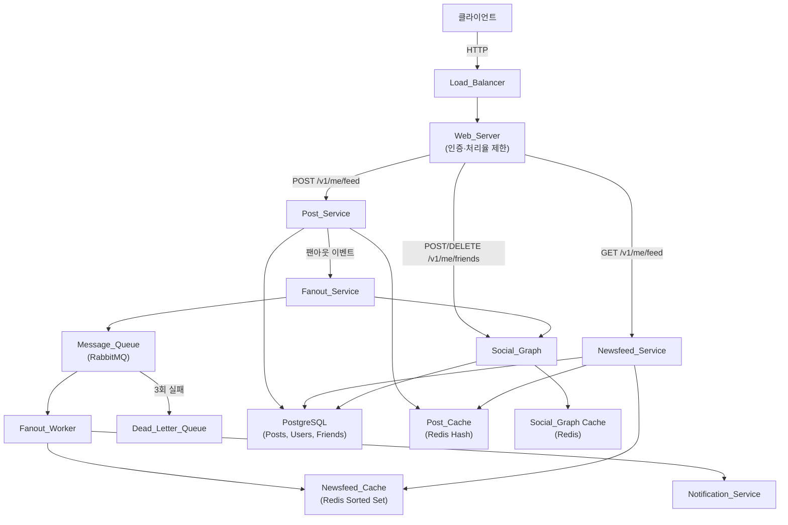
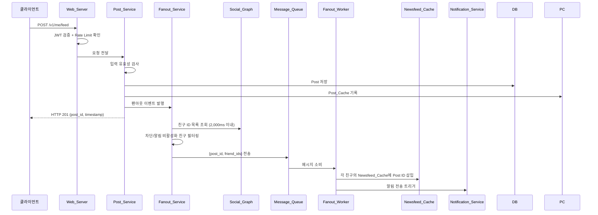
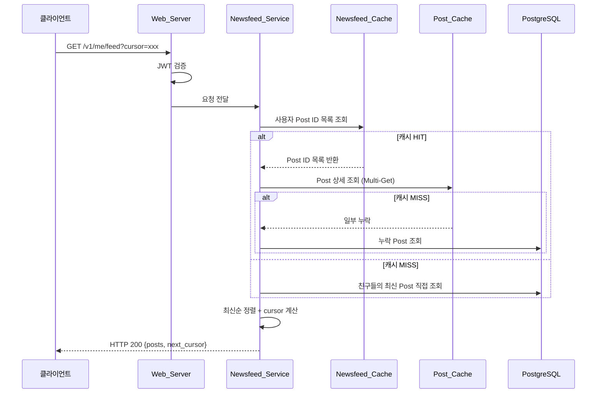

# 설계 문서

## Overview

뉴스피드 시스템은 사용자가 텍스트·이미지·비디오를 포함한 스토리(Post)를 게시하고, 친구들의 최신 스토리를 시간 역순으로 조회할 수 있는 소셜 피드 서비스다.

핵심 흐름은 두 가지다:

1. **피드 발행(Fanout)**: 사용자가 Post를 작성하면 Fanout_Service가 작성자의 친구 목록을 조회해 각 친구의 Newsfeed_Cache에 Post ID를 삽입한다.
2. **피드 읽기(Feed Read)**: 사용자가 피드를 요청하면 Newsfeed_Service가 Newsfeed_Cache에서 Post ID 목록을 가져오고, Post_Cache 또는 DB에서 상세 데이터를 조합해 반환한다.

팔로워 수가 10,000명을 초과하는 고팔로워(셀러브리티) 사용자의 경우, 쓰기 시점 푸시 대신 읽기 시점 풀(Pull) 모델을 적용하여 대규모 팬아웃의 쓰기 부하를 회피한다. 일반 사용자에게는 Push 모델을, 고팔로워 사용자에게는 Pull 모델을 적용하는 **Push-Pull 혼합 전략**을 사용한다.

### 기술 스택

| 구성 요소 | 선택 기술 | 이유 |
|---|---|---|
| API 서버 | Python / FastAPI | 비동기 지원, 타입 힌트, 빠른 프로토타이핑 |
| 데이터베이스 | PostgreSQL | 관계형 데이터 (사용자, Post, 친구 관계) |
| 캐시 | Redis | Sorted Set(피드), Hash(Post 상세), 처리율 제한 카운터 |
| 메시지 큐 | RabbitMQ | 팬아웃 비동기 처리, DLQ 지원 |
| 인증 | JWT (HS256) | 무상태 인증 토큰 |
| 소셜 그래프 | PostgreSQL + Redis | 친구 관계 저장 후 캐시 |

---

## Architecture

### 전체 시스템 아키텍처



### 피드 발행 흐름 (Push 모델)



### 피드 읽기 흐름



---

## Components and Interfaces

### Web_Server (API Gateway 역할)

JWT 검증과 처리율 제한을 담당하는 미들웨어 레이어.

**JWT 검증 미들웨어**
```
Input:  HTTP Request (Authorization 헤더)
Output: 검증된 user_id 또는 HTTP 401/503
```

처리 순서:
1. `Authorization: Bearer <token>` 헤더 추출
2. 헤더 없음 → `{"error": "인증 토큰이 없습니다"}` + HTTP 401
3. JWT 서명 검증 실패 → `{"error": "유효하지 않은 토큰입니다"}` + HTTP 401
4. JWT 만료 → `{"error": "토큰이 만료되었습니다"}` + HTTP 401
5. 검증 성공 → `user_id` 추출 후 다음 미들웨어 전달

**처리율 제한 미들웨어 (Sliding Window)**
```
Input:  user_id, endpoint
Output: 통과 또는 HTTP 429 {retry_after: N초}
```

Redis 슬라이딩 윈도우 알고리즘:
- Key: `rate_limit:{user_id}:{endpoint}`
- 60초 윈도우, POST /v1/me/feed 기준 최대 100회
- 초과 시 `Retry-After` 헤더 + `{"retry_after": N}` 반환
- Redis 접근 불가 시 HTTP 503

### Post_Service

Post 생성·삭제 및 캐시 동기화 담당.

**POST /v1/me/feed**
```
Input:  {body: str, media: [{type: "text"|"image"|"video", url: str}]}
Output: HTTP 201 {post_id, created_at} | HTTP 400 | HTTP 500
```

유효성 검사:
- `body` 길이 ≤ 2,000자
- `media` 항목 수 1~10개
- `media[].type` ∈ {"text", "image", "video"}

저장 순서:
1. 입력 검증 (실패 시 HTTP 400)
2. PostgreSQL에 Post 저장 (실패 시 HTTP 500, 캐시 기록 없음)
3. Post_Cache에 기록 (실패해도 HTTP 201 반환)
4. Fanout_Service에 이벤트 발행 (비동기)

**DELETE /v1/me/feed/{post_id}**
```
Input:  post_id (path param)
Output: HTTP 204 | HTTP 404 | HTTP 500
```

삭제 순서 (원자적 처리):
1. Post_Cache에서 삭제
2. PostgreSQL에서 삭제
3. 둘 중 하나라도 실패 시 롤백 → 이전 상태 유지 + HTTP 500
4. 성공 시 Fanout_Service에 삭제 이벤트 발행 (30초 이내 Newsfeed_Cache 반영)

### Fanout_Service

Post 저장 이벤트를 구독하여 친구들의 피드에 전파.

**Push 모델 (팔로워 ≤ 10,000)**
1. Social_Graph에서 친구 ID 목록 조회 (2,000ms 제한)
2. 차단/알림 비활성화 친구 필터링
3. `{post_id, friend_ids}` 메시지를 Message_Queue에 전송
4. MQ 전송 실패 시 최대 3회 재시도 → 실패 시 DLQ 기록

**Pull 모델 (팔로워 > 10,000)**
- Newsfeed_Cache 즉시 푸시 생략
- 조회 시점에 Post_Store에서 가져오도록 처리

**Post 삭제 팬아웃**
- 삭제 이벤트 수신 후 영향받는 모든 사용자의 Newsfeed_Cache에서 Post ID 제거 (30초 이내)
- 실패 시 최대 3회 재시도 → 실패 시 DLQ 기록

### Fanout_Worker

Message_Queue 소비자. Newsfeed_Cache 갱신 담당.

```
Input:  {post_id: str, friend_ids: [str], action: "insert"|"delete"}
Output: Newsfeed_Cache 갱신 완료 또는 DLQ 이동
```

처리 로직:
1. 메시지 소비
2. 각 친구의 Newsfeed_Cache(Redis Sorted Set)에 Post ID 삽입
   - Score = Post의 created_at 타임스탬프 (Unix 밀리초)
   - Newsfeed_Cache 크기 > 500 시 가장 오래된 항목(가장 낮은 score) 제거
3. 캐시 삽입 실패 시 최대 3회 재시도 → 실패 시 오류 로그
4. 완료 후 Notification_Service 트리거

### Newsfeed_Service

피드 조회 및 조합 담당.

**GET /v1/me/feed**
```
Input:  {cursor?: str, limit: int = 20}
Output: HTTP 200 {posts: [...], next_cursor: str|null} | HTTP 400 | HTTP 500
```

조회 로직:
1. cursor 검증 (유효하지 않으면 HTTP 400)
2. Newsfeed_Cache에서 Post ID 목록 조회
   - cursor 있을 경우: cursor 이후 항목만 가져오기
   - 캐시 없을 경우(MISS): DB에서 친구들의 최신 Post 직접 조회 (Fallback)
3. Post_Cache Multi-Get으로 상세 데이터 조회
   - 캐시에 없는 Post는 DB에서 조회 후 Post_Cache에 Back-fill
4. created_at 기준 내림차순 정렬
5. 다음 페이지 cursor 계산 (마지막 Post ID 기반)
6. 조회할 Post 없으면 cursor = null

### Notification_Service

Fanout_Worker로부터 트리거를 받아 푸시 알림 전송.

```
Input:  {post_id: str, author_id: str, recipient_ids: [str]}
Output: 알림 전송 완료 또는 재시도 로그
```

처리 로직:
1. 각 수신자의 알림 설정 조회
2. 푸시 알림 활성화된 사용자에게만 디바이스 푸시 전송
3. 전송 실패 시 30초 간격, 최대 3회 재시도
4. 3회 모두 실패 시 오류 로그 기록 및 작업 종료

### Social_Graph

친구 관계 저장 및 조회 담당.

**POST /v1/me/friends/{target_user_id}**
```
Input:  target_user_id (path param)
Output: HTTP 201 | HTTP 404 | HTTP 409
```

**DELETE /v1/me/friends/{target_user_id}**
```
Input:  target_user_id (path param)
Output: HTTP 204 | HTTP 404
```

제약 조건:
- 사용자 1인당 최대 친구 수: 5,000명
- 이미 친구 상태에서 추가 요청 → HTTP 409
- 존재하지 않는 사용자 → HTTP 404
- 친구 수 한도 초과 → HTTP 409 + 한도 초과 메시지
- 존재하지 않는 관계 삭제 → HTTP 404

---

## Data Models

### PostgreSQL 스키마

**users 테이블**
```sql
CREATE TABLE users (
    id          UUID PRIMARY KEY DEFAULT gen_random_uuid(),
    username    VARCHAR(50) NOT NULL UNIQUE,
    email       VARCHAR(255) NOT NULL UNIQUE,
    push_enabled BOOLEAN NOT NULL DEFAULT TRUE,
    device_token VARCHAR(255),
    created_at  TIMESTAMPTZ NOT NULL DEFAULT NOW(),
    updated_at  TIMESTAMPTZ NOT NULL DEFAULT NOW()
);
```

**posts 테이블**
```sql
CREATE TABLE posts (
    id          UUID PRIMARY KEY DEFAULT gen_random_uuid(),
    author_id   UUID NOT NULL REFERENCES users(id) ON DELETE CASCADE,
    body        VARCHAR(2000),
    created_at  TIMESTAMPTZ NOT NULL DEFAULT NOW(),
    updated_at  TIMESTAMPTZ NOT NULL DEFAULT NOW(),
    deleted_at  TIMESTAMPTZ  -- Soft Delete (물리 삭제 전 임시 표시)
);

CREATE INDEX idx_posts_author_created ON posts(author_id, created_at DESC);
```

**post_media 테이블**
```sql
CREATE TABLE post_media (
    id          UUID PRIMARY KEY DEFAULT gen_random_uuid(),
    post_id     UUID NOT NULL REFERENCES posts(id) ON DELETE CASCADE,
    media_type  VARCHAR(10) NOT NULL CHECK (media_type IN ('text', 'image', 'video')),
    url         TEXT,
    position    SMALLINT NOT NULL,  -- 미디어 순서 (0-indexed)
    CONSTRAINT chk_media_count CHECK (position BETWEEN 0 AND 9)
);

CREATE INDEX idx_post_media_post_id ON post_media(post_id);
```

**friendships 테이블**
```sql
CREATE TABLE friendships (
    user_id     UUID NOT NULL REFERENCES users(id) ON DELETE CASCADE,
    friend_id   UUID NOT NULL REFERENCES users(id) ON DELETE CASCADE,
    blocked     BOOLEAN NOT NULL DEFAULT FALSE,
    muted       BOOLEAN NOT NULL DEFAULT FALSE,  -- 알림 비활성화
    created_at  TIMESTAMPTZ NOT NULL DEFAULT NOW(),
    PRIMARY KEY (user_id, friend_id)
);

CREATE INDEX idx_friendships_user_id ON friendships(user_id);
CREATE INDEX idx_friendships_friend_id ON friendships(friend_id);
```

### Redis 데이터 구조

**Newsfeed_Cache (Sorted Set)**
```
Key:    newsfeed:{user_id}
Type:   Sorted Set
Score:  Post의 created_at (Unix 타임스탬프, 밀리초)
Member: post_id (UUID 문자열)
TTL:    48시간 (172,800초)
크기:   최대 500개 (초과 시 ZREMRANGEBYRANK로 가장 오래된 항목 제거)

예시:
  ZADD newsfeed:user-123 1700000001000 "post-abc"
  ZADD newsfeed:user-123 1700000002000 "post-def"
  ZREVRANGE newsfeed:user-123 0 19  -- 최신 20개 조회
```

**Post_Cache (Hash)**
```
Key:    post:{post_id}
Type:   Hash
Fields: author_id, body, media_json, created_at, deleted_at
TTL:    24시간 (86,400초)

예시:
  HSET post:post-abc author_id "user-456" body "Hello!" created_at "1700000001000"
```

**Rate Limit Counter (Sorted Set - Sliding Window)**
```
Key:    rate_limit:{user_id}:{endpoint}
Type:   Sorted Set
Score:  요청 시각 (Unix 타임스탬프, 밀리초)
Member: 요청 UUID

알고리즘:
  1. ZREMRANGEBYSCORE key 0 (now - 60,000ms)  -- 윈도우 밖 항목 제거
  2. ZCARD key                                   -- 현재 카운트 조회
  3. count >= 100 → HTTP 429
  4. ZADD key now request_uuid                   -- 현재 요청 기록
  5. EXPIRE key 60
```

**Social_Graph Cache (Set)**
```
Key:    friends:{user_id}
Type:   Set
Member: friend_id (UUID 문자열)
TTL:    10분 (600초)

Key:    friends:count:{user_id}
Type:   String
Value:  친구 수 (정수)
TTL:    10분 (600초)
```

### API 요청/응답 스키마

**POST /v1/me/feed Request**
```json
{
  "body": "오늘의 일상을 공유합니다.",
  "media": [
    {"type": "image", "url": "https://cdn.example.com/img/abc.jpg"},
    {"type": "video", "url": "https://cdn.example.com/vid/def.mp4"}
  ]
}
```

**POST /v1/me/feed Response (201)**
```json
{
  "post_id": "550e8400-e29b-41d4-a716-446655440000",
  "created_at": "2024-01-15T10:30:00Z"
}
```

**GET /v1/me/feed Response (200)**
```json
{
  "posts": [
    {
      "post_id": "550e8400-e29b-41d4-a716-446655440000",
      "author_id": "660e8400-e29b-41d4-a716-446655440001",
      "body": "오늘의 일상을 공유합니다.",
      "media": [
        {"type": "image", "url": "https://cdn.example.com/img/abc.jpg"}
      ],
      "created_at": "2024-01-15T10:30:00Z"
    }
  ],
  "next_cursor": "eyJwb3N0X2lkIjoiNTUwZTg0MDAifQ==",
  "has_more": true
}
```

**Error Response**
```json
{
  "error": "오류 메시지",
  "code": "ERROR_CODE"
}
```


---

## Correctness Properties

*A property is a characteristic or behavior that should hold true across all valid executions of a system — essentially, a formal statement about what the system should do. Properties serve as the bridge between human-readable specifications and machine-verifiable correctness guarantees.*

---

### Property 1: 유효하지 않은 JWT는 항상 401을 반환한다

*For any* HTTP 요청에 대해, 서명 검증에 실패한 임의의 JWT 토큰(잘못된 서명, 변조된 페이로드, 알 수 없는 알고리즘 등)을 포함하면, Web_Server는 항상 HTTP 401과 "유효하지 않은 토큰입니다" 오류 메시지를 반환해야 한다.

**Validates: Requirements 1.2**

---

### Property 2: 만료된 JWT는 항상 401을 반환한다

*For any* 만료 시각(과거 임의의 시점)을 가진 JWT 토큰에 대해, Web_Server는 항상 HTTP 401과 "토큰이 만료되었습니다" 오류 메시지를 반환해야 하며, 요청 작업을 수행하지 않는다.

**Validates: Requirements 1.3**

---

### Property 3: 처리율 제한은 100회 기준을 정확히 적용한다

*For any* user_id와 60초 윈도우 내 임의의 요청 횟수 N에 대해, N ≤ 100이면 요청이 통과하고 N > 100이면 HTTP 429와 함께 남은 대기 시간(초)을 반환해야 한다. 즉, `통과 여부 = (N ≤ 100)` 속성이 항상 성립해야 한다.

**Validates: Requirements 1.4**

---

### Property 4: 유효한 Post 저장은 항상 post_id와 타임스탬프를 포함한 201을 반환한다

*For any* 유효한 Post 요청(body ≤ 2,000자, media 1~10개, 올바른 타입)에 대해, Post_Service는 항상 HTTP 201을 반환하고 응답 본문에 UUID 형식의 post_id와 ISO 8601 형식의 created_at을 포함해야 한다.

**Validates: Requirements 2.1, 2.3**

---

### Property 5: 무효한 Post는 항상 400을 반환한다

*For any* 무효한 Post 요청(body > 2,000자 OR media가 0개 또는 11개 이상 OR 허용되지 않는 media 타입 포함)에 대해, Post_Service는 항상 HTTP 400과 유효성 검사 오류 메시지를 반환해야 한다.

**Validates: Requirements 2.2, 2.5, 2.6**

---

### Property 6: DB 저장 실패 시 캐시 상태는 변경되지 않는다

*For any* Post 생성 요청에서 데이터베이스 저장이 실패할 경우, Post_Cache의 상태는 요청 이전과 동일해야 한다(캐시 기록이 수행되지 않아야 한다).

**Validates: Requirements 2.4**

---

### Property 7: 캐시 저장 실패 시에도 DB 저장 성공이면 201을 반환한다

*For any* 유효한 Post에 대해 Post_Cache 기록이 실패하더라도, 데이터베이스 저장이 성공했다면 Post_Service는 항상 HTTP 201을 반환해야 한다.

**Validates: Requirements 2.7**

---

### Property 8: 팬아웃 필터는 차단/알림 비활성화 친구를 항상 제외한다

*For any* 친구 목록(차단 상태 또는 알림 비활성화 상태인 친구가 임의의 비율로 포함)에 대해, Fanout_Service의 필터링 결과에 차단 상태(`blocked=true`) 또는 알림 비활성화 상태(`muted=true`)인 친구가 단 한 명도 포함되어서는 안 된다.

**Validates: Requirements 3.2**

---

### Property 9: 셀러브리티 Post는 Newsfeed_Cache에 즉시 반영되지 않는다

*For any* 팔로워 수가 10,000명을 초과하는 작성자의 Post에 대해, 저장 직후 어떤 팔로워의 Newsfeed_Cache에도 해당 post_id가 삽입되지 않아야 하며, 읽기 시점에 Post_Store에서 조회 가능해야 한다.

**Validates: Requirements 3.5**

---

### Property 10: Newsfeed_Cache 크기는 항상 500개 이하로 유지된다

*For any* 사용자의 Newsfeed_Cache에 임의의 N개(1 ≤ N ≤ 600) Post ID를 순차 삽입할 때, 삽입 완료 후 캐시 크기는 항상 500 이하여야 하며, 제거된 항목은 항상 가장 오래된(created_at이 가장 이른) 항목이어야 한다.

**Validates: Requirements 3.6**

---

### Property 11: 재시도 로직은 최대 3회를 정확히 준수한다

*For any* 작업(MQ 전송, Cache 삽입, 알림 전송)에서 연속 실패 횟수 N에 대해, N < 3이면 재시도 후 성공 시 정상 완료하고, N = 3(3회 모두 실패)이면 작업을 Dead_Letter_Queue 기록 또는 오류 로그로 종료한다. 재시도 횟수가 3을 초과해서는 안 된다.

**Validates: Requirements 3.8, 3.9, 5.3, 7.5**

---

### Property 12: 피드는 항상 최신순(created_at 내림차순)으로 정렬된다

*For any* 임의의 순서로 주어진 Post 집합에 대해, Newsfeed_Service가 반환한 피드의 인접한 두 Post i, i+1에 대해 `posts[i].created_at >= posts[i+1].created_at`이 항상 성립해야 한다.

**Validates: Requirements 4.3**

---

### Property 13: 피드 페이지 크기는 항상 20개 이하이며 cursor는 올바르게 동작한다

*For any* 피드 데이터 크기(0개 이상)에 대해, 한 번의 GET /v1/me/feed 응답에 포함된 posts 배열의 크기는 항상 20 이하여야 하며, 다음 페이지가 없는 경우 next_cursor는 null이어야 한다.

**Validates: Requirements 4.4**

---

### Property 14: 유효하지 않은 cursor는 항상 400을 반환한다

*For any* 임의로 생성된 무효한 cursor 값(랜덤 문자열, 잘린 base64, 구조가 맞지 않는 값)에 대해, Newsfeed_Service는 항상 HTTP 400을 반환해야 한다.

**Validates: Requirements 4.7**

---

### Property 15: 캐시 미스 시 DB 폴백은 올바른 피드를 반환한다

*For any* Newsfeed_Cache가 비어 있는 사용자에 대해, GET /v1/me/feed 요청 시 데이터베이스에서 해당 사용자의 친구들이 작성한 최신 Post를 직접 조회하여 올바른 피드를 구성해야 한다.

**Validates: Requirements 4.6**

---

### Property 16: 알림은 push_enabled 설정에 따라 정확히 발송된다

*For any* 팔로워 목록(push_enabled=true/false가 임의 비율로 혼합)에 대해, Notification_Service는 push_enabled=true인 사용자에게만 디바이스 푸시를 전송하고, push_enabled=false인 사용자에게는 디바이스 푸시를 전송하지 않아야 한다.

**Validates: Requirements 5.2, 5.4**

---

### Property 17: 친구 추가는 양방향 관계를 생성하고 라운드트립을 보장한다

*For any* (user_id, target_id) 쌍에 대해, POST /v1/me/friends/{target_id} 성공 후 두 방향(`user_id → target_id`, `target_id → user_id`) 모두에서 친구 관계 조회 시 해당 관계가 존재해야 한다.

**Validates: Requirements 6.1**

---

### Property 18: 친구 삭제는 양방향 관계를 제거하는 라운드트립을 보장한다

*For any* 이미 친구 관계인 (user_id, target_id) 쌍에 대해, DELETE /v1/me/friends/{target_id} 성공 후 두 방향 모두에서 친구 관계 조회 시 해당 관계가 존재하지 않아야 한다.

**Validates: Requirements 6.2**

---

### Property 19: 친구 추가 중복 요청은 항상 409를 반환한다 (멱등성)

*For any* 이미 친구 관계인 (user_id, target_id) 쌍에 대해, POST /v1/me/friends/{target_id}를 반복 요청하면 두 번째 이후 요청은 항상 HTTP 409를 반환해야 한다.

**Validates: Requirements 6.4**

---

### Property 20: 친구 수는 5,000명 상한을 정확히 준수한다

*For any* user_id에 대해, 총 친구 수가 5,000명인 상태에서 추가 친구 요청을 보내면 HTTP 409와 한도 초과 오류 메시지를 반환해야 하며, 친구 목록의 크기는 여전히 5,000이어야 한다.

**Validates: Requirements 6.3, 6.6**

---

### Property 21: Post 삭제 후 캐시와 DB에서 모두 제거된다

*For any* 저장된 Post에 대해, DELETE 요청 성공 후 Post_Cache와 PostgreSQL 모두에서 해당 post_id로 조회 시 데이터가 존재하지 않아야 한다.

**Validates: Requirements 7.1, 7.2**

---

### Property 22: 부분 삭제 실패 시 캐시와 DB 상태는 삭제 이전으로 유지된다

*For any* 저장된 Post에 대해, 삭제 과정에서 Post_Cache 또는 PostgreSQL 중 하나가 실패할 경우, 오류 응답을 반환하고 Post_Cache와 PostgreSQL 모두에서 해당 데이터가 삭제 이전 상태로 유지되어야 한다.

**Validates: Requirements 7.3**


---

## Error Handling

### 오류 응답 형식

모든 오류 응답은 일관된 JSON 형식을 따른다.

```json
{
  "error": "사람이 읽을 수 있는 오류 메시지",
  "code": "MACHINE_READABLE_ERROR_CODE"
}
```

### HTTP 상태 코드 및 오류 코드 매핑

| HTTP 상태 | 오류 코드 | 발생 조건 |
|---|---|---|
| 400 | `VALIDATION_ERROR` | Post 본문 초과, 미디어 수/타입 오류, 잘못된 cursor |
| 401 | `MISSING_TOKEN` | Authorization 헤더 없음 |
| 401 | `INVALID_TOKEN` | JWT 서명 검증 실패 |
| 401 | `EXPIRED_TOKEN` | JWT 만료 |
| 404 | `NOT_FOUND` | 존재하지 않는 사용자/친구 관계 |
| 409 | `ALREADY_FRIENDS` | 이미 친구 관계인 사용자 |
| 409 | `FRIEND_LIMIT_EXCEEDED` | 친구 5,000명 한도 초과 |
| 429 | `RATE_LIMIT_EXCEEDED` | 처리율 제한 초과 (retry_after 포함) |
| 500 | `INTERNAL_ERROR` | DB 저장/조회 실패, 서버 내부 오류 |
| 503 | `SERVICE_UNAVAILABLE` | Rate Limit 저장소(Redis) 접근 불가 |

### 서비스별 오류 처리 전략

**Web_Server (인증 및 처리율 제한)**
- Redis 접근 불가 시: Fail-Open 대신 Fail-Closed (HTTP 503) 적용 — 처리율 제한 우회 방지
- JWT 파싱 자체가 실패하는 경우: `INVALID_TOKEN`으로 통일

**Post_Service**
- DB 저장 실패 시: 트랜잭션 롤백 후 HTTP 500, Post_Cache 기록 미수행
- Post_Cache 기록 실패 시: 오류 로그 기록 후 HTTP 201 반환 (Best-effort 캐시)
- 삭제 시 부분 실패(캐시 또는 DB 중 하나 실패): 전체 롤백, HTTP 500, 원본 데이터 유지

**Fanout_Service**
- Social_Graph 조회 실패: 오류 로그 + 팬아웃 중단 (포스트는 이미 저장된 상태)
- MQ 전송 실패: 지수 백오프 없이 즉시 재시도, 최대 3회, 실패 시 DLQ

**Fanout_Worker**
- Cache 삽입 실패: 최대 3회 재시도, 3회 실패 시 오류 로그 (DLQ 없음)
- 메시지 처리 중 예외: 메시지 ACK하지 않고 MQ에 반환하여 재처리

**Newsfeed_Service**
- Newsfeed_Cache MISS: DB 폴백으로 처리, 오류 아님
- DB 조회 실패: HTTP 500, 오류 로그

**Notification_Service**
- 전송 실패: 30초 간격, 최대 3회 재시도
- 3회 모두 실패: 오류 로그, 작업 종료 (알림은 best-effort, 피드 데이터에 영향 없음)

### 로깅 전략

모든 오류는 다음 정보를 포함하여 구조화된 JSON 로그로 기록한다.

```json
{
  "timestamp": "2024-01-15T10:30:00Z",
  "level": "ERROR",
  "service": "post_service",
  "user_id": "550e8400-...",
  "trace_id": "abc123",
  "error_code": "DB_WRITE_FAILED",
  "message": "PostgreSQL insert failed",
  "details": "..."
}
```

---

## Testing Strategy

### 이중 테스트 접근법

단위 테스트(특정 예시, 경계값, 오류 조건)와 속성 기반 테스트(모든 입력에 대한 보편적 속성)를 함께 사용한다.

**단위 테스트**는 구체적인 시나리오와 통합 지점, 경계값에 집중한다.  
**속성 기반 테스트**는 임의 입력에 대한 보편적 속성을 검증하여 단위 테스트가 놓치는 엣지 케이스를 포착한다.

### 속성 기반 테스트 (Property-Based Tests)

**사용 라이브러리**: Python [Hypothesis](https://hypothesis.readthedocs.io/)

각 속성 테스트는 최소 100회 이상 반복 실행되며, 테스트 코드에 다음 형식의 태그 주석을 포함한다.

```python
# Feature: newsfeed-system, Property {번호}: {속성 내용 요약}
```

**테스트 파일 구조**

```
tests/
├── unit/
│   ├── test_auth_middleware.py
│   ├── test_post_service.py
│   ├── test_fanout_service.py
│   ├── test_newsfeed_service.py
│   ├── test_notification_service.py
│   └── test_social_graph.py
├── property/
│   ├── test_property_auth.py          # Property 1, 2, 3
│   ├── test_property_post.py          # Property 4, 5, 6, 7
│   ├── test_property_fanout.py        # Property 8, 9, 10, 11
│   ├── test_property_newsfeed.py      # Property 12, 13, 14, 15
│   ├── test_property_notification.py  # Property 16
│   └── test_property_social_graph.py  # Property 17, 18, 19, 20, 21, 22
└── integration/
    ├── test_post_publish_flow.py
    ├── test_fanout_timing.py          # Requirements 3.1, 7.4
    └── test_newsfeed_read_flow.py
```

**속성 테스트 예시**

```python
# tests/property/test_property_post.py

from hypothesis import given, settings
from hypothesis import strategies as st

# Feature: newsfeed-system, Property 5: 무효한 Post는 항상 400을 반환한다
@given(
    body=st.text(min_size=2001, max_size=5000),  # 길이 초과
)
@settings(max_examples=200)
def test_post_body_too_long_returns_400(body):
    response = post_service.create_post(body=body, media=[{"type": "text", "url": None}])
    assert response.status_code == 400

# Feature: newsfeed-system, Property 3: 처리율 제한은 100회 기준을 정확히 적용한다
@given(
    user_id=st.uuids(),
    request_count=st.integers(min_value=1, max_value=150),
)
@settings(max_examples=100)
def test_rate_limit_boundary(user_id, request_count):
    results = [rate_limiter.check(str(user_id), "POST:/v1/me/feed") for _ in range(request_count)]
    passed = [r for r in results if r.allowed]
    blocked = [r for r in results if not r.allowed]
    assert len(passed) == min(request_count, 100)
    assert len(blocked) == max(0, request_count - 100)
```

### 단위 테스트 커버리지 목표

| 서비스 | 목표 커버리지 | 주요 테스트 대상 |
|---|---|---|
| Web_Server | 90% | JWT 검증, Rate Limit, 오류 응답 |
| Post_Service | 90% | 입력 검증, DB/캐시 저장, 삭제 롤백 |
| Fanout_Service | 85% | 친구 필터링, 셀러브리티 분기, 재시도 |
| Fanout_Worker | 85% | 캐시 삽입, 500개 상한 유지, 재시도 |
| Newsfeed_Service | 90% | 캐시 조회, DB 폴백, 정렬, 페이지네이션 |
| Notification_Service | 80% | 알림 설정 필터, 재시도, 작업 종료 |
| Social_Graph | 90% | 친구 추가/삭제, 5000명 제한, 중복 방지 |

### 통합 테스트

통합 테스트는 실제 Redis, PostgreSQL, RabbitMQ 연결을 사용하여 서비스 간 흐름을 검증한다.

| 테스트 시나리오 | 검증 항목 | 요구사항 |
|---|---|---|
| Post 발행 → 팬아웃 흐름 | Post 저장 후 Newsfeed_Cache 갱신 (전체 흐름) | 2.1, 3.1~3.4 |
| 팬아웃 타이밍 | Social_Graph 조회 2,000ms 이내 완료 | 3.1 |
| Post 삭제 → 캐시 제거 | 삭제 후 30초 이내 Newsfeed_Cache에서 Post ID 제거 | 7.4 |
| 캐시 MISS → DB 폴백 | 캐시 없는 사용자 피드 조회 시 DB에서 올바른 피드 반환 | 4.6 |
| 알림 전송 흐름 | 팬아웃 완료 후 push_enabled 사용자에게만 알림 발송 | 5.1~5.4 |

### 테스트 환경

- **로컬 개발**: Docker Compose로 PostgreSQL, Redis, RabbitMQ 컨테이너 구성
- **CI**: GitHub Actions에서 Docker Compose 기반 통합 테스트 실행
- **속성 기반 테스트**: 로컬 및 CI 모두에서 실행, 최소 100회 반복
